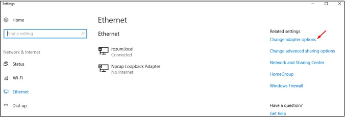

# Rozum Robotics IO Board v1.0.3 simple Python API

API allows you to connect pc to Rozum Robotics IOBoard and simply make control via input/output commands

Setting communication with the IO Board v1.0.3

1. Switch on your PC.
2. In the right corner of the Taskbar, left-click the network connection indicator.

<p align='center'>

</p>

3. Select an active Ethernet connection next to the network connection indicator. The
connection name can differ, depending on your network settings.

<p align='center'>

</p>

4. In the displayed Ethernet settings window, click Change adapter options.

<p align='center'>

</p>

5. In the displayed Network Connections window, right-click the Ethernet icon and
select Properties.

<p align='center'>

</p>

6. On the Networking tab in the displayed Ethernet properties window, double-click
Internet Protocol Version 4 (TCP/IPv4).

<p align='center'>

</p>

7. In the IP Version 4 (TCP/IPv4) window, select Use the following IP address and
set up the IP address and the Subnet Mask fields to the value as shown below.

<p align='center'>

</p>

8. Click OK to confirm the settings.

## Connect to IOBoard:

```python
            from io_board import IOBoard

            ip = '7.7.7.3'
            port = 23000
            timeout = 0.1

            io = IOBoard(ip=ip, port=port, timeout=timeout)
```

In default ***timeout*** is 0.1 seconds

***set_digital_output(numberPin, state)***

Set digital output in 'HIGH'/'LOW' state

```python
            io.set_digital_output(1, 'HIGH')
```

***get_digital_input(inputPin)***

Get state of entered digital input
Return True or False value. Print 'HIGH' or 'LOW'

```python
            io.get_digital_input(1)
            >>>'LOW'
```

***get_digital_outputs()***

Return a set() of digital outputs that are in 'HIGH' state

```python
            io.get_digital_outputs()
            >>>(1, 4, 3)
```

***get_digital_inputs()***

Return a set() of digital inputs that are in 'HIGH' state

```python
            io.get_digital_inputs()
            >>>(2, 3, 5)
```